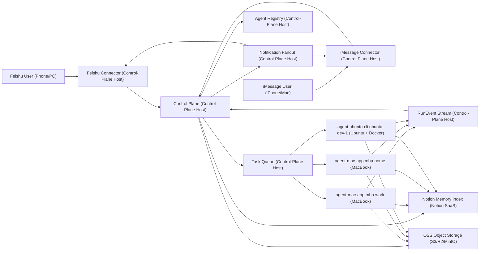

# 一键部署的多端 Codex Bridge（Mac Codex App + Ubuntu Codex CLI）

## Summary
将系统升级为“可一键部署”的混合架构：
1. 支持多台 Mac（Codex App）和 Ubuntu（Codex CLI）同时接入。
2. 每台设备有独立 `agent_name`，飞书/iMessage 可点名下发。
3. 必须显式指定目标设备，不支持自动选择设备。
4. 共享记忆采用分层架构：Notion 做结构化索引层，OSS 做原文与大证据内容层。
5. 部署入口采用 `install.sh`，并支持 Ubuntu 容器化 agent。
6. 配置/密钥采用“集中下发”：一次性注册码换取本机 `.env`。

## 目标架构
1. `control-plane`（中心路由器）
- 接收飞书/iMessage 指令，做路由、去重、状态聚合。
- 管理设备注册与心跳（Mac + Ubuntu）。
- 统一写入 Notion 索引与任务记录，并维护 OSS 内容引用。

2. `agent-mac-app`
- 运行在每台 MacBook。
- 读取 `~/.codex/state_5.sqlite` + `~/.codex/sessions/*.jsonl` 抽取 thread 结果。
- 上报里程碑：`started / tool_error / completed`。

3. `agent-ubuntu-cli`（容器内）
- 运行 Codex CLI 执行器（容器中调用 Codex CLI）。
- 通过挂载工作目录执行任务并回传结果。
- 与 Mac agent 使用同一任务协议。

4. `connectors`
- Feishu connector：收发消息 + 白名单。
- iMessage connector：通过 BlueBubbles 体系收发 + 白名单。
- 两端统一支持：
`list`（返回 Markdown 设备/session 列表）
`@codex @agent:<name> @session:<session_id> @proj:<alias> <task>`（按会话继续控制）
- 两端支持“主动回推”：
  - `list` 查询结果会主动推送回请求通道
  - 任务受理信息会主动推送回请求通道
  - 任务执行里程碑（`started|tool_error|completed`）由 control-plane 主动扇出回原始通道

5. `memory-sync`
- 结构化记忆索引写入 Notion；原文与大证据片段写入 OSS；两者通过 `oss_uri` + citation 关联。

## 一键部署方案（Install Script）
1. 顶层脚本：`./install.sh`
- 参数：`--role control-plane|agent-mac|agent-ubuntu`
- 参数：`--agent-name <name>`、`--bootstrap-code <code>`、`--project-map <path>`
- 作用：安装依赖、拉起服务、注册 agent、写 system service 或容器编排文件。

2. Control-plane 一键安装
- `install.sh --role control-plane`
- 初始化数据库、生成一次性注册码、启动 API/worker/connectors。

3. Mac agent 一键安装
- `install.sh --role agent-mac --agent-name mbp-work --bootstrap-code xxx`
- 自动拉取配置，创建常驻服务，注册到 control-plane。

4. Ubuntu agent 一键安装（容器化）
- `install.sh --role agent-ubuntu --agent-name ubuntu-dev-1 --bootstrap-code xxx`
- 安装 Docker，拉起 `codex-agent-runner` 容器。
- 挂载：
`/workspace`（项目目录）
`/var/lib/codex-agent`（状态）
`/root/.codex` 或等效凭据路径（按 CLI 鉴权方式）

## Public APIs / Types
1. 入站命令格式
- `@codex @agent:<name> @proj:<alias> <task>`
- 示例：`@codex @agent:ubuntu-dev-1 @proj:backend 修复支付重试`
- 复用已有会话：`@codex @agent:<name> @session:<session_id> @proj:<alias> <task>`
- 查看所有设备 session：发送 `list`（返回 Markdown 表格，含每个设备的 session 与最后输出）

1.1 Session API
- `GET /api/sessions/list`：返回结构化 session 列表
- `GET /api/sessions/markdown`：返回 Markdown 设备/session 概览（适合飞书/iMessage 直接显示）

2. `TaskEnvelope`
- `task_id`
- `source`
- `source_message_id`
- `requester_id`
- `target_agent`
- `project_alias`
- `instruction`
- `session_id`（可选；指定后复用已有 session/thread）
- `priority`
- `created_at`

3. `AgentDescriptor`
- `agent_name`
- `agent_type(mac_app|ubuntu_cli)`
- `capabilities`
- `status`
- `queue_len`
- `last_seen`

4. `RunEvent`
- `task_id`
- `agent_name`
- `thread_id`
- `event_type`
- `summary`
- `timestamp`

## 调度与策略
1. 指定设备：强制路由；设备离线则直接返回失败（必须重新指定在线设备）。
2. 不支持自动路由，`@agent` 参数必须显式给出目标设备名。
3. 任务执行：默认新建独立 thread（隔离和可追踪）。
4. 通知粒度：关键里程碑推送（开始、错误、完成）。
5. 鉴权：飞书用户白名单 + iMessage 联系人白名单。
6. 去重：`source + source_message_id` 全局幂等。

## 配置与密钥分发（集中下发）
1. Control-plane 生成一次性 `bootstrap_code`（短时有效）。
2. Agent 首启携带 `bootstrap_code` 注册并换取专属 `agent_token` 与配置。
3. 本地写入 `.env`（或密钥文件）后，注册码立即失效。
4. Token 定期轮换，失联设备可吊销。

### 通知回推配置（新增）
1. control-plane 事件扇出：
- `CODEX_BRIDGE_FEISHU_PUSH_URL`
- `CODEX_BRIDGE_IMESSAGE_PUSH_URL`

2. connector 主动回推（list/accepted）：
- `FEISHU_OUTBOUND_PUSH_URL`
- `IMESSAGE_OUTBOUND_PUSH_URL`

3. 启动/连通性状态通知接收目标：
- `FEISHU_STATUS_RECIPIENT`
- `IMESSAGE_STATUS_RECIPIENT`

说明：
- 若未配置上述 URL，API 仍返回 webhook 响应，但不会主动回推（返回 `skipped`）。
- connector 启动时会发送 `started` 状态；若探测不到 control-plane，会额外发送 `control_plane_unreachable` 状态。
- control-plane 启动时会向飞书与 iMessage 推送 `control-plane started` 状态（可通过 `CODEX_BRIDGE_SYSTEM_STATUS_NOTIFY_ENABLED=false` 关闭）。

## 共享记忆规范（Notion 索引 + OSS 内容）
1. 共享原则
- Notion 只存结构化索引，不存 PDF/文档原文全文。
- 原文、长证据片段与大对象存储在 OSS。
- 每条记忆必须可追溯到原始证据位置（页码或片段锚点）。

1.1 Notion 隔离策略（防止污染个人文档）
- 建立独立 Teamspace：`Codex Memory`（仅系统写入）。
- 建立双数据库：
`Memory Index`（机器写，结构化索引）
`Human Docs`（人工写，手工文档）
- 机器写入统一打标：
`source=agent`、`visibility=system`、`owner=codex-bot`
- bot 账号最小权限：只允许写 `Codex Memory`，禁止写个人空间页面。
- 默认视图规则：个人工作区不展示 `visibility=system` 记录。

2. 结构化记忆字段（MemoryRecord）
- `memory_id`
- `source_type`（`pdf` / `doc` / `web` / `chat`）
- `source_doc_id`（文档唯一标识）
- `source_version`（文档版本或哈希）
- `oss_uri`（原文或证据对象地址）
- `visibility`（`system` / `human`）
- `owner`（例如 `codex-bot` 或人工账号）
- `summary`（摘要）
- `conclusions`（结论）
- `key_pages`（关键页码列表）
- `evidence_snippets`（证据片段列表）
- `citations`（可追溯引用列表）
- `extracted_at`（提取时间，UTC + ISO8601）
- `extracted_by_agent`（提取 agent 名）
- `ttl_seconds`（有效期）
- `fresh_until`（到期时间）
- `status`（`fresh` / `stale` / `superseded`）

3. 可追溯引用格式（Citation）
- `source_doc_id`
- `page`
- `snippet_hash`
- `snippet_text`
- `locator`（例如 `pdf://<doc_id>#page=<n>`）
- 其他 agent 使用结论前，必须至少命中 1 条有效 citation 进行回跳验证。

4. 新鲜度策略（TTL + 版本校验）
- 若 `now > fresh_until`，记忆状态标记为 `stale`，禁止直接复用，需重抽取。
- 若检测到 `source_version` 变化（文档更新/哈希变化），立即标记 `superseded`，需重抽取。
- 重抽取后写入新 `memory_id`，旧记录保留但不再用于默认检索。
- 建议保留策略：超过 90 天的 `stale/superseded` 记录自动转移到 `Memory Archive` 数据库。

5. 读取策略
- agent 读取记忆时先查 Notion 索引，仅拉取 `status=fresh` 的记录。
- 命中后按 `oss_uri` 从 OSS 拉取原文/证据详情，再按 citation 回跳验证。
- 若仅命中 `stale/superseded`，系统返回“需重抽取”并触发重新提取流程。

## 部署图（Production Deployment View）
Mermaid 版本（单图、兼容写法）：

图中关系说明：
1. Feishu/iMessage 用户先进入各自 connectors（运行在 Control-Plane Host），再进入 control-plane。
2. control-plane 运行在 Control-Plane Host，统一连接 Agent Registry、Queue、Notion 索引与 OSS 内容层。
3. `agent-mac-app` 运行在 MacBook；`agent-ubuntu-cli` 运行在 Ubuntu + Docker。
4. agents 通过 `RunEvent` 回传 control-plane，再由 Notification Fanout 回推通道。
5. Notion 负责索引检索，OSS 负责内容承载，二者联合提供跨机回溯验证能力。

## GitHub 类似项目对比
说明：以下项目用于能力对比与组件复用参考，不是本方案的等价替代。

| 项目 | 链接 | 主要能力 | 可复用点 | 相对本方案的缺口 |
|---|---|---|---|---|
| remote-agentic-coding-system | https://github.com/coleam00/remote-agentic-coding-system | 远程控制 Claude Code/Codex，支持多平台入口与持久会话 | 远程任务控制、容器化部署思路、会话持久化 | 未内建 Mac Codex App 本地 session 抽取；未提供 Notion 索引 + OSS 结构化记忆规范 |
| bluebubbles-server | https://github.com/BlueBubblesApp/bluebubbles-server | iMessage 转发与收发基础设施 | iMessage 通道接入、消息监听与发送能力 | 不覆盖飞书、不提供 Codex 多 agent 调度与任务协议 |
| oapi-sdk-python | https://github.com/larksuite/oapi-sdk-python | 飞书 OpenAPI 服务端 SDK（事件订阅、消息等） | 飞书消息收发、签名校验、事件处理 | 仅 SDK，不包含跨设备 agent 路由、记忆分层和一键部署编排 |
| iMCP | https://github.com/mattt/iMCP | macOS 侧 MCP 服务，支持 Messages/Contacts 等 | 本地 Messages 能力暴露、MCP 风格接口 | 偏单机 MCP 服务，不是多节点 Codex 执行与控制平面 |
| imessage_tools | https://github.com/my-other-github-account/imessage_tools | 读取 chat.db 与发送 iMessage（含 Ventura 解析） | 兼容 `attributedBody` 的消息解析实现 | 非控制平面架构，无飞书、无多 agent 调度与共享记忆治理 |

结论（针对本项目）：
1. 现有开源项目可覆盖“通道能力”或“单机能力”，但没有完整覆盖“多 Mac + Ubuntu Codex CLI + 飞书/iMessage + Notion 索引 + OSS 内容层 + install.sh 一键部署”的一体化方案。
2. 建议采用“组合式实现”：飞书用 `oapi-sdk-python`，iMessage 用 `BlueBubbles`（或 `imessage_tools` 作解析参考），控制平面与记忆治理按本 README 规范自建。

## 测试场景
1. `install.sh` 三角色安装成功率（control-plane/mac/ubuntu）。
2. Ubuntu 容器 agent 执行 Codex CLI 任务并回传完成事件。
3. 多设备命名路由：`@agent:mbp-home` / `@agent:ubuntu-dev-1` 正确执行。
4. 缺少 `@agent` 或指定离线设备时，系统拒绝执行并返回明确错误。
5. 两端通道一致性：飞书下发 + iMessage 查状态一致。
6. 白名单拦截、去重幂等、断线重连恢复。
7. Notion 索引跨机可检索，且可通过 `oss_uri` + citation 回跳验证。
8. 机器写入记录默认落在 `Codex Memory` Teamspace，不出现在个人文档主视图。
9. 写入隔离测试：bot 写入仅落在 `Codex Memory`，个人空间不可写。
10. 可见性测试：默认个人视图不显示 `visibility=system`。
11. 检索链路测试：先索引后 OSS，缺失 `oss_uri` 时返回显式错误。
12. 新鲜度测试：TTL 到期/版本变化后旧记录不复用并触发重抽取。
13. 引用验证测试：无有效 citation 的结论不得进入“可复用”状态。
14. 归档测试：超过 90 天的 `stale/superseded` 记录自动进入 `Memory Archive`。

## 实现状态矩阵
| 模块 | 状态 | 说明 |
|---|---|---|
| `common` 类型与配置 | `tested` | `TaskEnvelope/AgentDescriptor/RunEvent/MemoryRecord/Citation` 已实现并有单测覆盖 |
| `control-plane` API 闭环 | `tested` | 注册、心跳、拉任务、任务下发、事件回传、幂等已实现并有集成测试 |
| `agent-mac-app` runner | `tested` | pull + heartbeat + completed 事件回传已实现（V1 mock 执行） |
| `agent-ubuntu-cli` runner | `tested` | pull + heartbeat + mock codex 执行 + completed 回传已实现 |
| `memory-sync`（本地抽象） | `tested` | SQLite 索引 + 本地 OSS + citation/oss_uri 门禁 + fresh 过滤 |
| connectors | `tested` | `Feishu bridge` + `BlueBubbles iMessage bridge` 均支持 `list` 与 `@session` 指令 |
| `install.sh` 三角色安装 | `done` | 支持 `control-plane|agent-mac|agent-ubuntu` 与参数落盘 |
| GitHub Actions CI | `done` | `ruff + mypy + pytest + coverage>=80%` |
| GitHub tag release | `done` | `v*.*.*` 触发构建、校验和、自动 Release |

README 验收标准：
1. 包含全部 10+ 章节且无缺段。
2. 三角色安装命令与参数说明完整。
3. 三个核心类型与字段完整无遗漏。
4. 路由规则（必须显式指定设备）明确。
5. 幂等规则（`source + source_message_id`）明确。
6. 密钥分发流程（一次性 `bootstrap_code` -> `agent_token` -> 失效）明确。
7. 部署图可渲染且节点齐全。
8. 测试场景 7 条全部落入文档。
9. 记忆过期（TTL）或文档版本变化时触发重抽取并阻止旧记忆默认复用。
10. 记忆查询流程为“先查 Notion 索引，再取 OSS 内容”，避免直接全量扫描 OSS。
11. Notion 权限隔离生效：bot 仅能写系统库，无法写个人文档库。
12. `MemoryRecord` 已包含 `oss_uri`、`visibility`、`owner`、`status`、`fresh_until`、`source_version`。

## Assumptions & Defaults
1. Ubuntu 容器可合法使用并认证 Codex CLI（通过宿主机凭据挂载或环境变量授权）。
2. iMessage 通道采用 BlueBubbles 方案（非纯 AppleScript 接收）。
3. Notion 作为共享记忆索引库，OSS 作为内容存储层；Notion 不保存原文全文。
4. Notion 使用独立 Teamspace 与系统标签隔离机器写入，避免与个人文档混淆。
5. 默认中文命令与通知。
6. 时间戳按秒级统一处理并在协议中标准化（UTC + ISO8601）。

## 附录：落地顺序（建议）
1. 先落地 `control-plane` 基础能力：路由、去重、状态聚合。
2. 再接入 `agent-mac-app`：先读 thread/session，再上报 `RunEvent`。
3. 接入 `agent-ubuntu-cli` 容器执行器，打通 CLI 回传。
4. 最后接入 Feishu + iMessage connectors 和 Notion memory-sync。
5. 用测试场景逐条验收，确认可一键部署与跨机共享记忆达标。

实现文件入口：
1. 应用入口：[src/control_plane/app.py](/Users/ckt1010/project/codex-agent/src/control_plane/app.py)
2. 运行脚本：[scripts/install.sh](/Users/ckt1010/project/codex-agent/scripts/install.sh)
3. Mermaid 原文件：[architecture.mmd](/Users/ckt1010/project/codex-agent/architecture.mmd)
